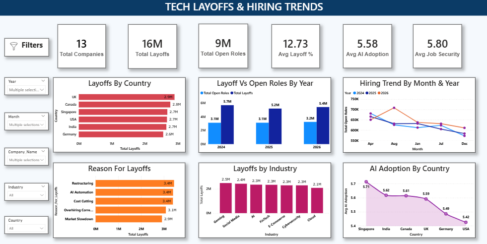

# Tech Layoffs & Hiring Trends | Power BI Dashboard

## 📊 Project Overview

This project presents an interactive Power BI dashboard created to analyze tech layoffs, hiring trends, open roles, AI adoption, and job security across different countries, industries, and years.

The dashboard uses KPI cards, charts, slicers, and filters to explore workforce trends and compare different aspects of the technology job market.

## 🎯 Project Objectives

- Analyze total layoffs and open roles
- Compare layoffs across countries
- Analyze layoffs by industry
- Identify major reasons for layoffs
- Compare layoffs with open roles by year
- Analyze hiring trends by month and year
- Compare AI adoption across countries
- Analyze average layoff percentage and job security

## 🔍 Dashboard Analysis

### Key KPIs

- Total Companies
- Total Layoffs
- Total Open Roles
- Average Layoff %
- Average AI Adoption
- Average Job Security

### Visualizations

- Layoffs by Country
- Layoff vs Open Roles by Year
- Hiring Trend by Month & Year
- Reason for Layoffs
- Layoffs by Industry
- AI Adoption by Country

## 🛠️ Tools & Technologies

- Power BI
- Power Query
- DAX
- Data Modeling
- Data Visualization
- Interactive Slicers & Filters
- KPI Cards
- Bar Charts
- Column Charts
- Line Charts

## 🧹 Data Preparation

Power Query was used for data transformation and preparation before creating the dashboard.

The data was cleaned and transformed to prepare it for analysis and visualization.

## 📈 Key Features

- Interactive Year filter
- Interactive Month filter
- Company Name filter
- Industry filter
- Country filter
- Dynamic KPI cards
- Interactive charts
- Cross-filtering between visuals

## 🖼️ Dashboard Preview

## 📁 Project Files

- [Tech_Layoffs_Hiring_Trends_.pbix](./Tech_Layoffs_Hiring_Trends.pbix) - Power BI dashboard file
- [Tech_Layoffs_Hiring_Trends_Dashboard.png](./Tech_Layoffs_Hiring_Trends_Dashboard.png) - Dashboard preview

